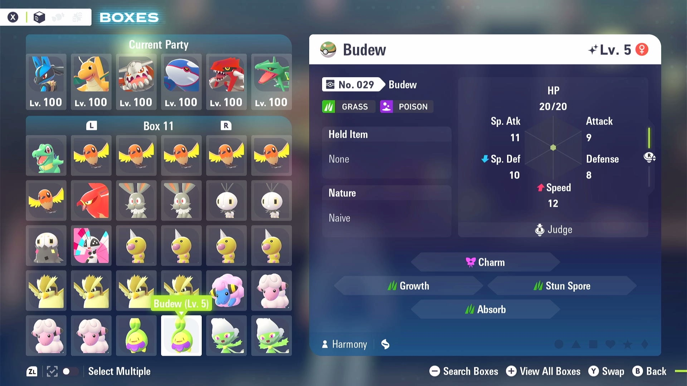

# Box Sorter (Currently In Development. Not Released to Public Yet)

## Program Description

This program sort one or more boxes of Pokémon to help your organize your boxes. It can sort based on regional dex number (in the order of Lumiose dex followed by Hyperspace dex), alphaness and shiniess.
It will skip empty slots and empty boxes. It does not differentiate forms of Pokémon sharing the same dex entry. You will need to organize forms on your own.

The program helps you create your living dex and remove redundant regular and shiny Pokémon:

### Setup of Settings

**Switch Settings:**

1. Screen size: Must be 100% within the Switch settings
2. [Switch 2: All HDR options must be disabled.](../NintendoSwitch/Switch2Notes.md#switch-2-hdr-may-be-problematic)
3. [Switch 2: The profile you are using must be the 1st (left-most) profile.](../NintendoSwitch/Switch2Notes.md#resetting-a-game-moves-the-cursor-to-the-1st-user-profile)

**Program Settings:**

1. Video Resolution: 1080p or higher

### Instructions

1. Enter your box system.
2. You are on the "BOXES" view, not "HELD ITEMS" or "BATLE TEAMS" view.
3. Move the cursor to the first box you want to start sorting. Don't let the cursor hold any Pokémon.

## Options

### Number of Boxes to Sort:

The program will sort this many boxes, starting at the current box where you start the program.

### Sort Order Rules:

Set up your sorting rules. Each table row is a rule on the Pokémon order. Available rules are:

- Dex Number: Pokémon are placed in the order of Lumiose dex followed by Hyperspace dex.
- Shiny: shiny Pokémon will be placed at front.
- Alpha: Alpha Pokémon will be placed at front.

The higher a rule is in the table, the "outer" or "earlier" the rule applies. e.g. for a table of rule "Dex Number" followed by "Alpha".
It will have the order: Alpha Chikorita, Chikorita, Alpha Bayleef, Bayleef, ... Basically, the program first sorts Pokémon based on dex numbers. Then
for each subgroup of Pokémon with the same dex number, sort them by their alphaness.

Each rule also has a "reverse" checkerbox to reverse its ordering. e.g. reversed "Alpha" rule will place Alpha Pokémon at end.

### Output File

The program saves the catalogued Pokémon information into `<output_file>.json` and its planned sorted Pokémon order into `<output_file>-sorted.json`.

### Dry Run

If checked, the program will only catalogue Pokémon information into `<output_file>.json` and `<output_file>-sorted.json` without sorting the Pokémon in game.
This is useful for exporting your Pokémon data.

## Credits

- **Author:** Gin

**Discord Server:** 

