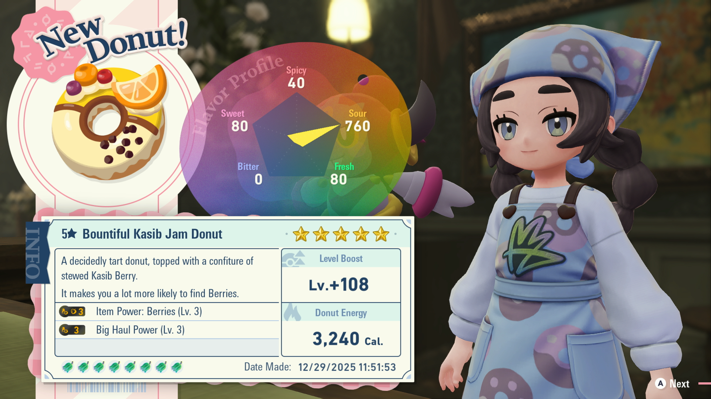

# Donut Maker

## Program Description

Make donuts and reset until a donut with the desired flavor powers is found.

### Setup of Settings

**Switch Settings:**

1. Screen size: Must be 100% within the Switch settings
2. [Switch 2: All HDR options must be disabled.](../NintendoSwitch/Switch2Notes.md#switch-2-hdr-may-be-problematic)
3. [Switch 2: The profile you are using must be the 1st (left-most) profile.](../NintendoSwitch/Switch2Notes.md#resetting-a-game-moves-the-cursor-to-the-1st-user-profile)

**Program Settings:**

1. Video Resolution: 1080p or higher
2. The language in the option must match your in-game language.

**Game Settings:**

1. Text Speed: Fast
2. Your have more than 8 types of regular berries and 8 types of hyperspace berries. The program assumes each line of the berry menu always has a valid berry when making a donut.
3. You have more berries than the quantities required to make the donut, as using up a berry makes the icon appear faded and interferes with proper berry reading.

### Instructions

1. Fly to Vert Pokemon Center and heal your team to create a backup save at that location.
2. Start the program.

### Notes and Example
When filling in the Flavor Powers table, make sure your donut is possible by using a [donut calculator](https://rotomlabs.net/legends-z-a/donut-maker) first.

Setup Example:

The target donut is:

- Big Haul Power (Lv. 2)
- Item Power: Berries (Lv. 3)
- No Power/Power does not matter

Number of Powers to Match is set to 2, because only two powers are targeted.

The Flavor Powers table has the following set:

- Big Haul Lv. 2
- Big Haul Lv. 3
- Berry Lv. 3

With this setup, the program will match any donut with Big Haul 2 or 3, but will only match Berry 3. So the following donuts would all match under these settings:

- Big Haul Lv. 2, Berry Lv. 3
- Big Haul Lv. 3, Berry Lv. 3
- Big Haul Lv. 2, Berry Lv. 3, Alpha Power Lv. 1

Make sure not to leave unnecessary powers on the table. If the Flavor Power table above had Alpha Power Lv. 1 on it, a dount with Big Haul Lv. 2, Alpha Power Lv. 1, Item Power: Coins Lv. 1 would count as a match, as there would be 2 successful hits (Number of Powers to Match) on the table.

## Options

### Game Language:

Select the language that matches what you are using in-game. This setting is required to read berries and donut powers.

### Berries Table:

The berries that will be used to make the donut. Must enter a minimum of three berries and a maximum of eight.

One berry per line. To use a berry more than once, select it in multiple rows.

### Number of Powers to Match:

How many of a created donut's powers must be in the the table below (number of hits). Minimum one, maximum three.

### Number of Donuts:

The program continues resetting and making donuts of required powers until this many donuts of required powers are made.
Make sure you have enough berries to make this many donuts. The program will fail when not given enough berries.

### Flavor Powers Table:

Add your desired flavor powers to this table. Note that "All Types" means the all types power in-game. If you want all Pokemon types, they will all have to be added individually.

### Go Home when Done:

Go to the Switch Home to idle when finished.

## Credits

- **Authors:** Gin, kichithewolf

**Discord Server:** 

