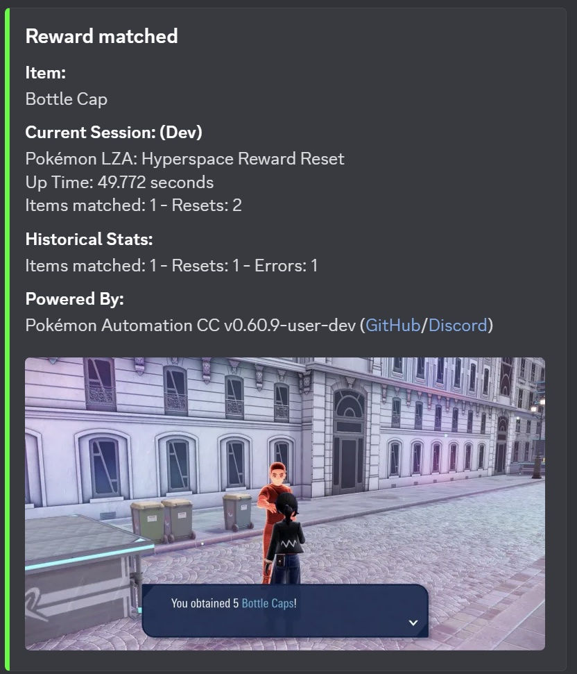

# Hyperspace Reward Reset

## Program Description

Reset in front of a Hyperspace Battle Zone trainer to receive a specific reward. Go to Switch Home screen when the reward is found.

### Setup of Settings

**Switch Settings:**

1. Screen size: Must be 100% within the Switch settings
2. [Switch 2: All HDR options must be disabled.](../NintendoSwitch/Switch2Notes.md#switch-2-hdr-may-be-problematic)

**Program Settings:**

1. Video Resolution: 1080p or higher

**Game Settings:**

1. Text Speed: Fast

### Instructions

1. In a Hyperspace Battle Zone, win against a trainer that gives a prize. Do not talk to the trainer afterwards.
   * Make sure the trainer can give the target item(s). For example, Couriers will not give you Pokéballs. [This Serebii page](https://www.serebii.net/legendsz-a/hyperspacelumiose.shtml) has all the Hyperspace battle zone trainer gift tables.
3. Save the game and reset. (Reset is required because the trainer position will change to the spawn location when reloaded.)
4. Re-enter the game and save again, this time in front of the trainer. Make sure you will not be spotted by another trainer.
5. Start the program.

The program will talk to the trainer and check the reward. If the reward is not selected in the table below, it will reset the game.

## Options

### Game Language:

Select the language that matches what you are using in-game. This setting is required to read rewards.

### Items Table:

Use this table to specify which rewards you want to be notified for.

## Credits

- **Author:** kichithewolf

**Discord Server:** 

