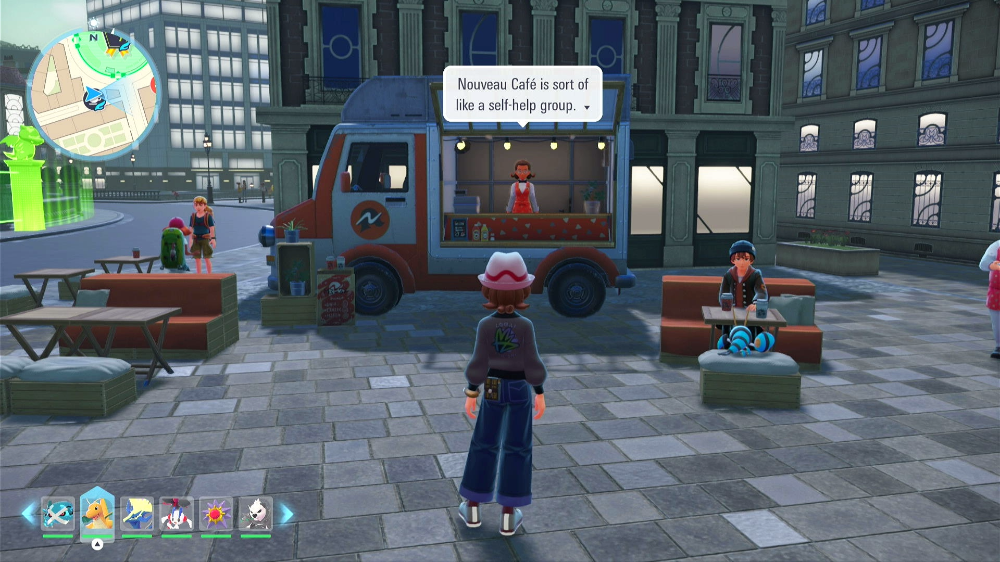
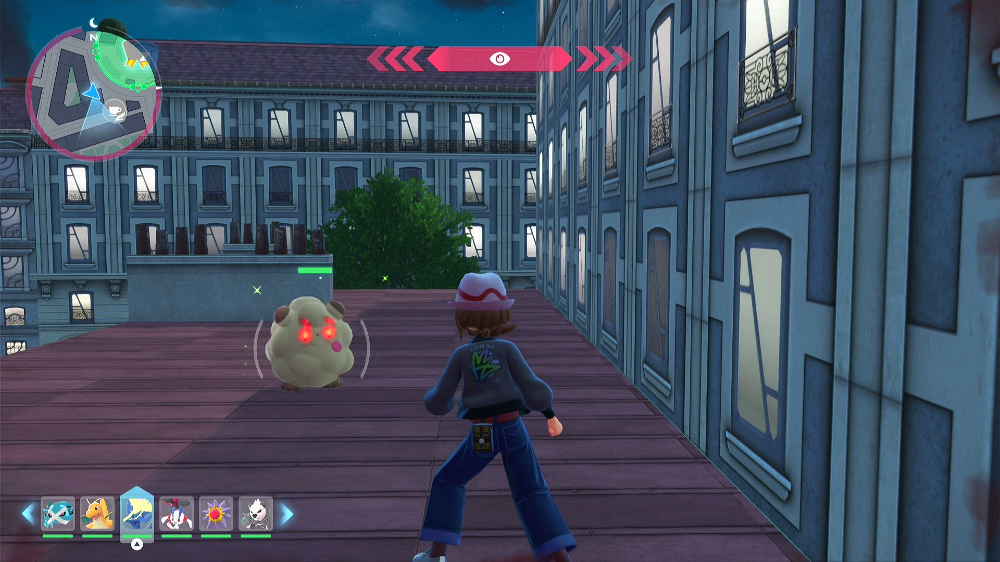
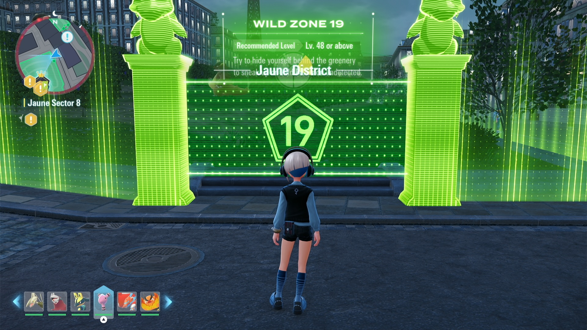
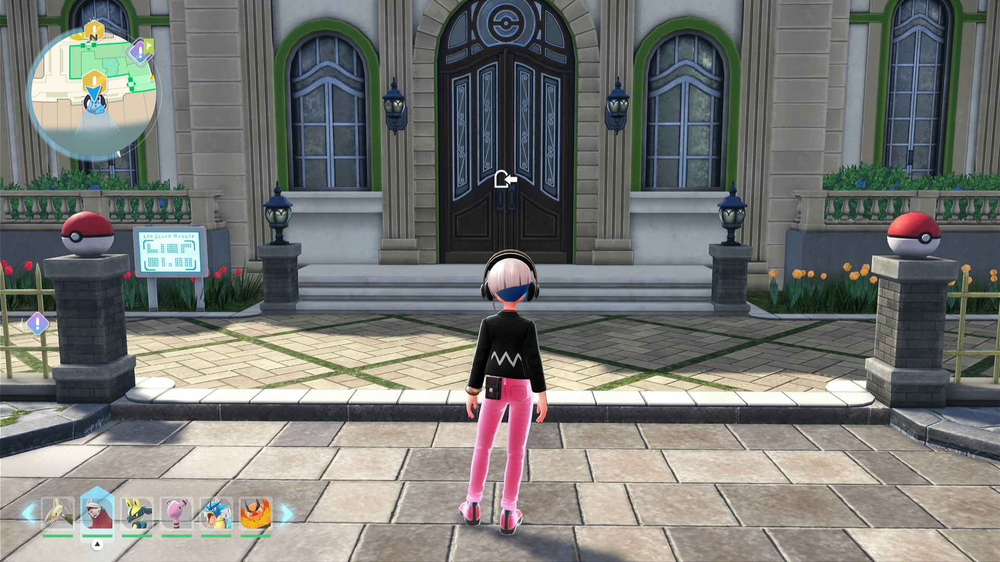
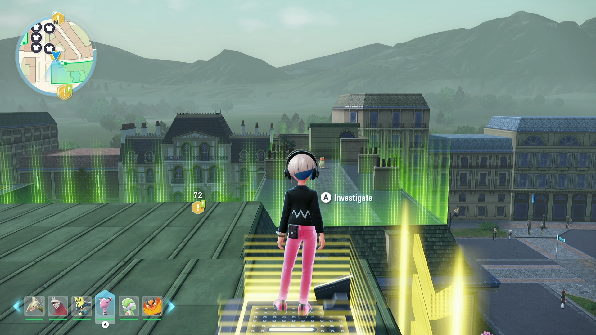

# Shiny Hunt - Fly Spot Reset (beta testing, not available yet)

See also: [Shiny Hunting Recommendations](ShinyHuntRecommendations.md)

## Program Description

Shiny hunt by repeatedly fast traveling to the same spot outside Wild Zones. This will shiny hunt all spawns within 50m of the spot. Unlike blind macros, this program will tolerate the day/night cycle and will detect audible shinies that are nearby.

This program can shiny hunt:

- An alpha Swirlix near Nouveau Cafe (Truck No. 3).
- A non-alpha Swirlix near the same cafe
- A Dedenne/Emolga spawner on the street near Magenta Pokémon Center.
- Two Mareep and a Pichu in Wild Zone 1 near Pokémon Research Lab. (The Mareep are about 50m from the lab. They can be hunt on Switch 2. Unclear on Switch 1.)
- Pokemon near the entrance of Hyperspace Wild Zones.
- Wild Zone 19.
- Alpha Pidgey in Wild Zone 1.
- Hyperspace Wild Zone.

This program only works for fly spots outside Wild Zones (Lumiose City). To shiny hunt more Pokémon in Wild Zones, use our [Shiny Hunt - Wild Zone Entrance](ShinyHunt-WildZoneEntrance.md) program.

With the Shiny Charm you will get a shiny Pokémon quite fast if there are many Pokémon spawned around you. Don't let the program run for too long or have old shinies overwritten by new ones.

Shiny sound detection will happen at most once to avoid detecting the same shiny Pokémon over and over.

### Setup of Settings

**Switch Settings:**

1. Screen size: Must be 100% within the Switch settings
2. [Switch 2: All HDR options must be disabled.](../NintendoSwitch/Switch2Notes.md#switch-2-hdr-may-be-problematic)

**Program Settings:**

1. Video Resolution: 1080p or higher

### Instructions

1. Fast travel to a fly spot outside Wild Zones.
2. Start the program in the game.

## Options

### Hunt Route

The route to follow.

- No Movement in Lumiose
- Hyperspace Wild Zone
- Wild Zone 19
- Alpha Pidgey (Wild Zone 1)

#### No Movement in Lumiose

Fast travel to a fly spot in Lumiose City, e.g. Nouveau Cafe No. 3, Pokémon Research Lab, etc.

#### Hyperspace Wild Zone

You are in hyperspace and not regular Lumiose. Be sure to set the Hyperspace Resets option below:

Number of resets when running the Hyperspace Wild Zone route. This setting does not apply when any other route is selected. Each fly takes about 1 Cal. of time. Make sure to leave enough time to catch found shinies.

#### Wild Zone 19

Fast travel to Wild Zone 19, standing in front of the entrance. This route covers right half of the wild zone, including Furfrou, Audino, Eevee, Kangaskhan, Cleffa/Clefairy (night only), Drampa (daytime only), and a Patrat outside of the wild zone.

#### Alpha Pidgey (Wild Zone 1)

Fast travel to Pokémon Research Lab. This route will makes the character run repeatedly from the lab to the building near Wild Zone 1 and get to the roof by the elevator. While the target is the Alpha Pidgey in Wild Zone 1, it also reaches other regular Pidgey (can't be alpha) on the roof or lamppost, Kakuna tree, Mareep and Pichu in Wild Zone 1, a Buneary in a fenced yard, and a Hawlucha on the roof.

### Shiny Sound Detected Action

When a shiny sound is heard, perform one of the following actions:

- Stop program and go Home. Send notification.
- Keep running. Notify on first shiny sound only. (default)
    - When running at Nouveau Cafe (Truck No. 3), the program will detect shiny sound if the alpha Swirlix becomes shiny.

## Credits

- **Author:** Gin

**Discord Server:** 

