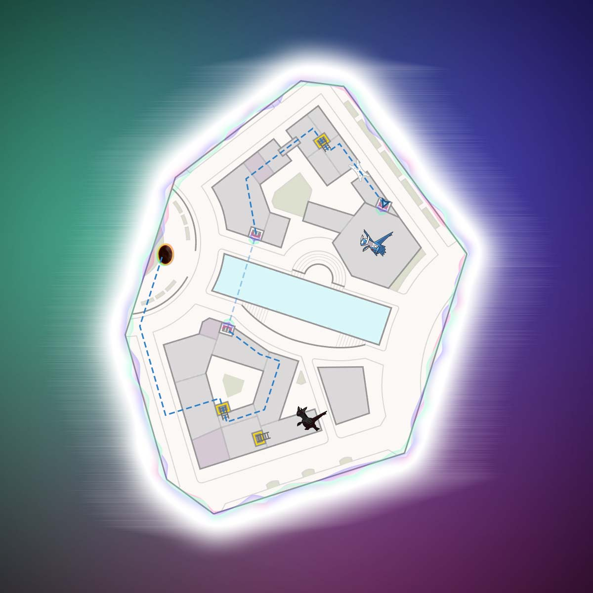
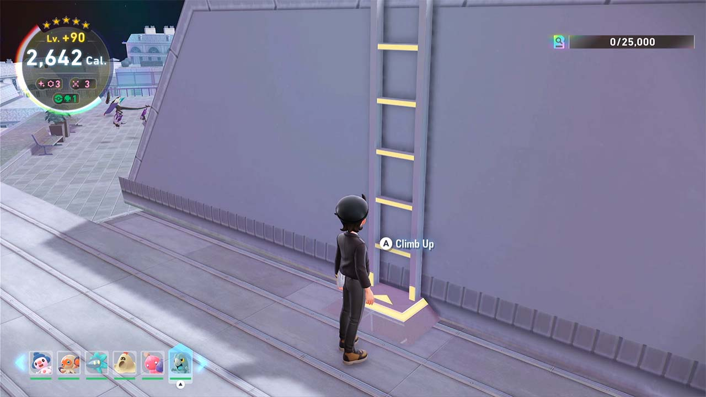
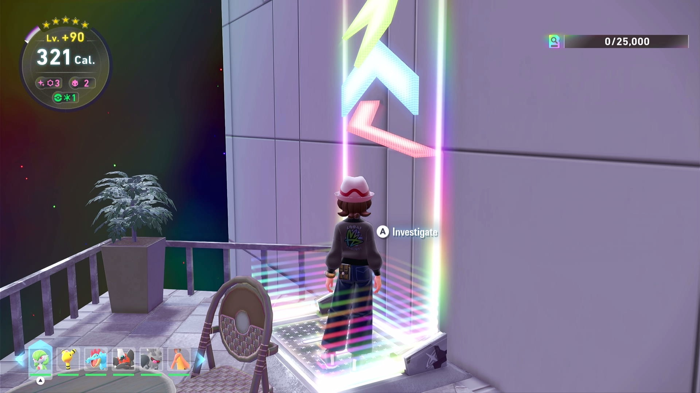
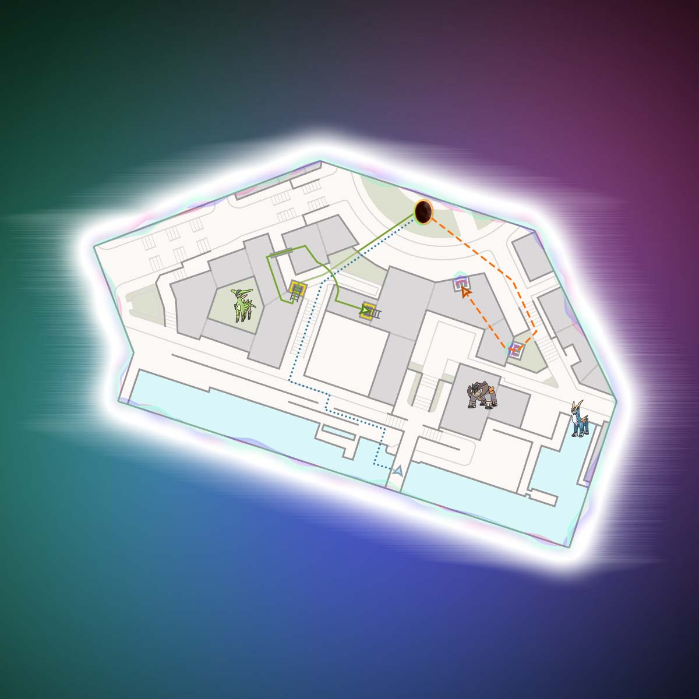
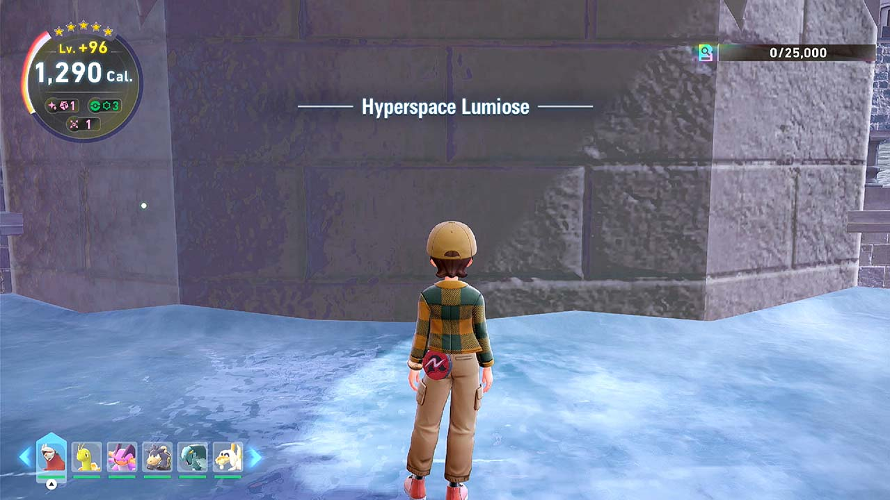
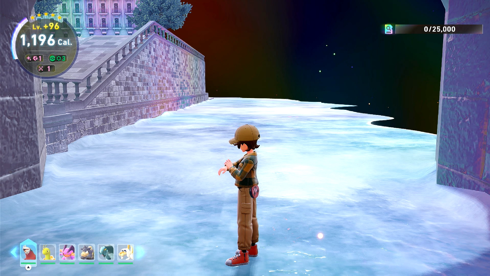
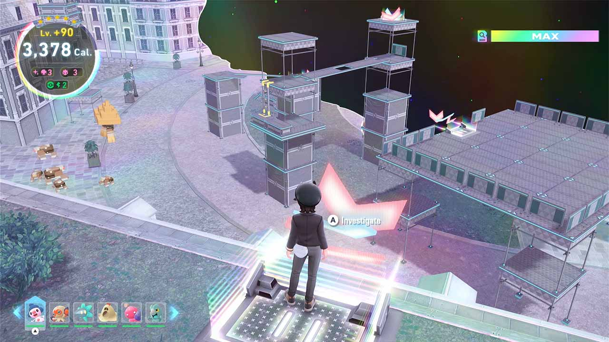
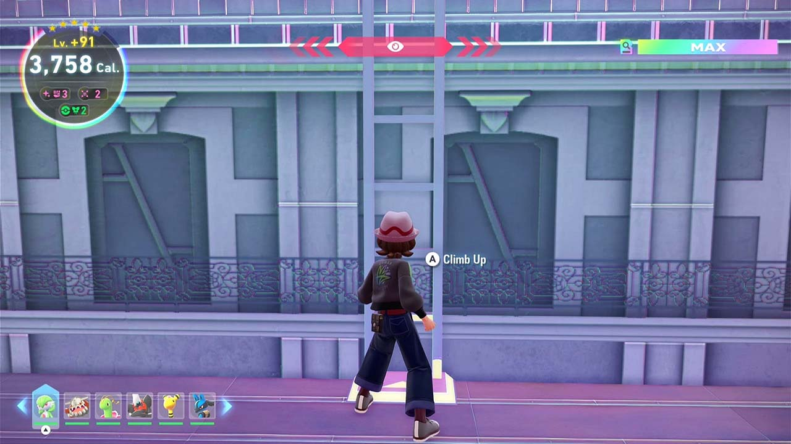

# Shiny Hunt - Hyperspace Legendary (Beta Testing, Not Released Yet)

## Program Description

Automate various legendary Pokémon shiny hunting in their Hyperspace Wild Zones. It uses various shuttle run, teleportation, or game reset methods to hunt each legendary Pokémon accordingly. It resets the game if it runs out of calories. It stops when a shiny sound is detected, assuming it's from the legendary Pokémon.

Shiny huntable legendary Pokémon are Latias, Latios, Cobalion, Terrakion, and Virizion. Their wild zones can only found via special scans. Each special scan has the chance to spawn one of these five non-shiny-locked legendaries if it hasn't already been caught. Each legendary has its own unique setup required before starting the program.

Shiny odds for the legendaries are affected by the Shiny Charm and Sparkling Power donuts but the size and IVs are fixed.

### Setup of Settings

**Switch Settings:**

1. Screen size: Must be 100% within the Switch settings
2. [Switch 2: All HDR options must be disabled.](../NintendoSwitch/Switch2Notes.md#switch-2-hdr-may-be-problematic)
3. [Switch 2: The profile you are using must be the 1st (left-most) profile.](../NintendoSwitch/Switch2Notes.md#resetting-a-game-moves-the-cursor-to-the-1st-user-profile)
4. Camera controls should be set to default - Regular (not Inverted) with Camera Sensitivity 3.

**Program Settings:**

1. Video Resolution: 1080p or higher

**Game Settings:**

1. Text Speed: Fast

### Before You Start

- Know to use the backup save: the game places a backup save every time the player fast travels in Lumiose City (note: not in Hyperspace Lumiose). When loading the backup save, it places the player to the last Pokécenter where they talked to the nurse. If anything goes bad or you run out of time in a hyperspace, you can use the backup save to redo the hunt.

- The program resets the game when it runs out of calories. The calories you spent before saving the game in hyperspace are the calories the program cannot use to shiny hunt. Every fast travel in Hyperspace creates a save (but not a backup save). Be careful not to do unnecessary fast travels. If that happens, use the backup save to fix it.

- Be sure to use a 5-star Sparkling Power lv. 3 donut to give you good catch rate and high shiny rate. Use a donut with enough calories to be efficient in shiny hunting.

- Come prepared. Have a good team of Pokémon that can catch the legendary quickly. Have enough Pokéballs you want to catch it with.

### Instructions

1. Enter a 5-star hyperspace legendary wild zone.
2. Based on the legendary you want to hunt, move to the location shown on the maps below. Written instructions are also provided if needed.
3. If hunting Latias or Swords of Justice, set enough calories in option **Minimum Cal. Reserved to Catch Legendary**. A 5-star hyperspace burns 10 calories per second.
4. Save the game at the location described below.
5. Start the program.

Movement for each legendary:

#### Eon Duo

| Pokémon | Image |
| --- | --- |
| **Latias** - From the entrance, make a hard right and follow the street - The building on the left side of the street has a tunnel into a courtyard, enter the courtyard - Immediately after the tunnel, turn right and climb the ladder to the top and climb onto the roof - Go left, and climb onto the roof with the Noibat/Noivern - Once you're on that roof, climb onto the higher roof on your right - Go to up to the ladder that leads up to Latias, don't climb it - Stand in front of the ladder with the "A" button prompt visible  Note: You may need to defeat or de-aggro Noibat/Noivern to save |  |
| **Latios** - From the entrance, make a hard right and follow the street - The building on the left side of the street has a tunnel into a courtyard, enter the courtyard - Immediately after the tunnel, turn right and climb the ladder to the top and climb onto the roof - Go left, and climb onto the roof with the Hawlucha - Go towards the left, past the Hawlucha - Drop onto the roof with the chimneys and use the Holovator pad on the far end to get across the canal - Go towards and climb onto the roof that is higher - Cross the bridge that is ahead, clearing the vines in the way - Climb the ladder to the right - Walk across the web - After crossing the web, drop off the roof onto the terrace that's straight ahead  - Stand on the Holovator pad that leads to the roof top where Latios resides, with the "A" button prompt visible  Note: Make sure you have enough Calories left to catch it. |  |

#### Swords of Justice

| Pokémon | Image |
| --- | --- |
| **Cobalion** - From the entrance, run forwards and right and drop into the alley - Go down the stairs - At the bottom of the stairs, turn left towards the bridge, and take the ramps down to the canal level - Move onto the ice  - Go under the bridge while on the ice  - Make sure your character is beneath the very center of the bridge and that your camera is directly facing the wall |   |
| **Terrakion** - Go left from the entrance - Go halfway down the stairs - Turn right onto the grass - Take the Holovator pad up to the roof - Turn towards the right and go to the Holovator pad that points towards the scaffolding near the entrance - Make sure the "A" button prompt is visible | 
| **Virizion** - From the entrance, run forward and right and drop into the alley - Climb the ladder on the far right side - Climb onto the roof, and move to the plank on the right - Cross the plank and climb onto the roof - Use the Rotom Glide to jump onto the building toward the right, the one with a warp pad - Move to the ladder at the end, face the ladder with the "A" button prompt visible |  

## Options

### Shiny Sound Detected Action

When a shiny sound is heard, perform one of the following actions:

- Stop program and go Home. Send notification. (default)
- Keep running. Notify on first shiny sound only.
- Keep running. Notify on all shiny sounds.

The only option you should use is "Stop program and go Home." The other options are incompatible with soft-resets and exists only because this entire option block is shared with the other shiny hunting programs.

### Take a Video

Record a video of the encounter.

### Screenshot Delay

When a shiny is detected, wait this long before you take a screenshot and record a video. This will allow the screen to completely load before taking the screenshot.

### Legendary Pokémon

Which Legendary you are hunting.

### Minimum Cal. Reserved to Catch Legendary (Does not apply to Latios)

Minimum amount of calories you need to catch the legendary after the program find it shiny. It burns 10 calories per second in those 5-star legendary Hyperspace Wild Zones.

The program will likely aggro the legendary, prepare enough time to fight it. Kill any other Pokémon following you first. Once you defeat the legendary, save in front of it and use the [Post-Kill Catcher](PostKillCatcher.md) program to catch it. If you prefer to save before battling it, start with a higher calorie limit to have more time to leave the area and drop aggro, save, and return to battle it.

## Credits

- **Author:** Gin, Gimikyu, Cryson, theAstrogoth

**Discord Server:** 

