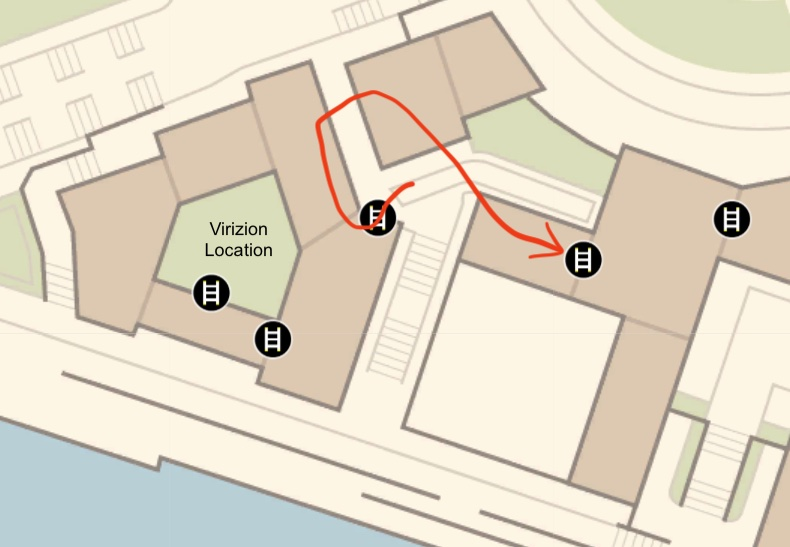

# Shiny Hunt - Hyperspace Legendary (In Beta, Not Released Yet)

## Program Description

Automate various legendary Pokémon shiny hunting in their Hyperspace Wild Zones. It uses various shuttle run, teleportation, or game reset methods to hunt each legendary Pokémon accordingly. It resets the game if it runs out of calories. It stops when a shiny sound is detected, assuming it's from the legendary Pokémon.

Currently only support Terrakion and Virizion.

### Setup of Settings

**Switch Settings:**

1. Screen size: Must be 100% within the Switch settings
2. [Switch 2: All HDR options must be disabled.](../NintendoSwitch/Switch2Notes.md#switch-2-hdr-may-be-problematic)
3. [Switch 2: The profile you are using must be the 1st (left-most) profile.](../NintendoSwitch/Switch2Notes.md#resetting-a-game-moves-the-cursor-to-the-1st-user-profile)

**Program Settings:**

1. Video Resolution: 1080p or higher

**Game Settings:**

1. Text Speed: Fast

### Before You Start

- Know to use the backup save: the game places a backup save every time the player fast travels in Lumiose City (note: not in Hyperspace Lumiose). When loading the backup save, it places the player to the last Pokécenter where they talked to the nurse. If anything goes bad or you run out of time in a hyperspace, you can use the backup save to redo the hunt.

- The program resets the game when it runs out of calories. The calories you spent before saving the game in hyperspace are the calories the program cannot use to shiny hunt. Every fast travel in Hyperspace creates a save (but not a backup save). Be careful not to do unnecessary fast travels. If that happens, use the backup save to fix it.

- Be sure to use a 5-star Sparkling Power lv. 3 donut to give you good catch rate and high shiny rate. Use a donut with enough calories to be efficient in shiny hunting.

- Come prepared. Have a good team of Pokémon that can catch the legendary quickly. Have enough Pokéballs you want to catch it with.

### Instructions

1. Enter a 5-star hyperspace legendary wild zone.
2. Based on the legendary you want to hunt, move to the location shown below.
3. Set enough calories in option **Minimum Cal. Reserved to Catch Legendary**.
4. Save the game at the location described below.
5. Start the program.

Movement for each legendary:

#### Virizion:

Virizion hides in a courtyard next to the Justice Dojo that is only accessable via rooftop. Follow the map below to climb onto the rooftop and move to the top of a nearby building overlooking the dojo. Face towards the ladder on that building with button A visible. Save the game and start the program.

 

## Options

### Shiny Sound Detected Action

When a shiny sound is heard, perform one of the following actions:

- Stop program and go Home. Send notification. (default)
- Keep running. Notify on first shiny sound only.
- Keep running. Notify on all shiny sounds.

The only option you should use is "Stop program and go Home." The other options are incompatible with soft-resets and exists only because this entire option block is shared with the other shiny hunting programs.

### Take a Video

Record a video of the encounter.

### Screenshot Delay

When a shiny is detected, wait this long before you take a screenshot and record a video. This will allow the screen to completely load before taking the screenshot.

### Legendary Pokémon

Which Legendary you are hunting.

### Minimum Cal. Reserved to Catch Legendary

Minimum amount of calories you need to catch the legendary after the program find it shiny.

- Virizion: the program will drop the player character into the courtyard to draw Virizion's aggression. Prepare enough time to fight it in the courtyard. Kill any other Pokémon following you into the courtyard first. Once you defeat Virizion, save in front of it and use the [Post-Kill Catcher](PostKillCatcher.md) program to catch it. If you prefer to save before battling it, add more calories to have time leaving the courtyard, drop aggro, save and return to battle it.

## Credits

- **Author:** Gimikyu/Ericzklm, Cryson, Gin

**Discord Server:** 

