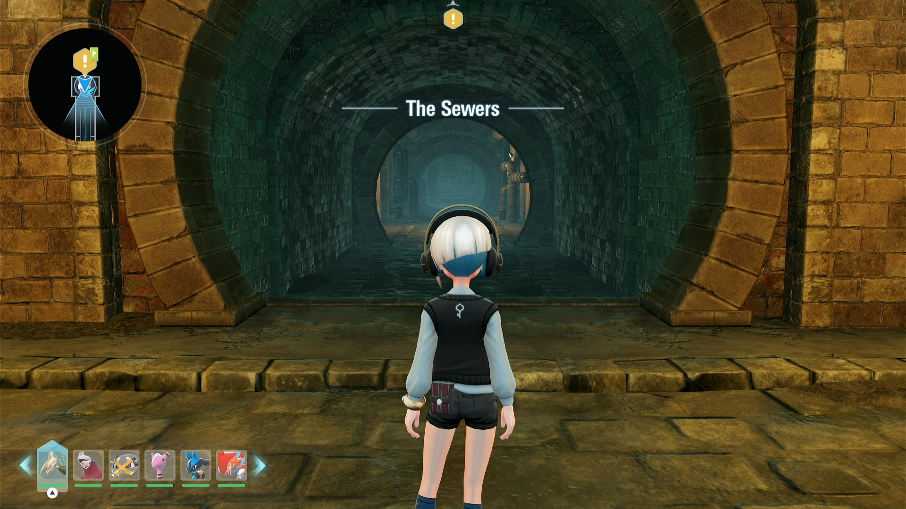
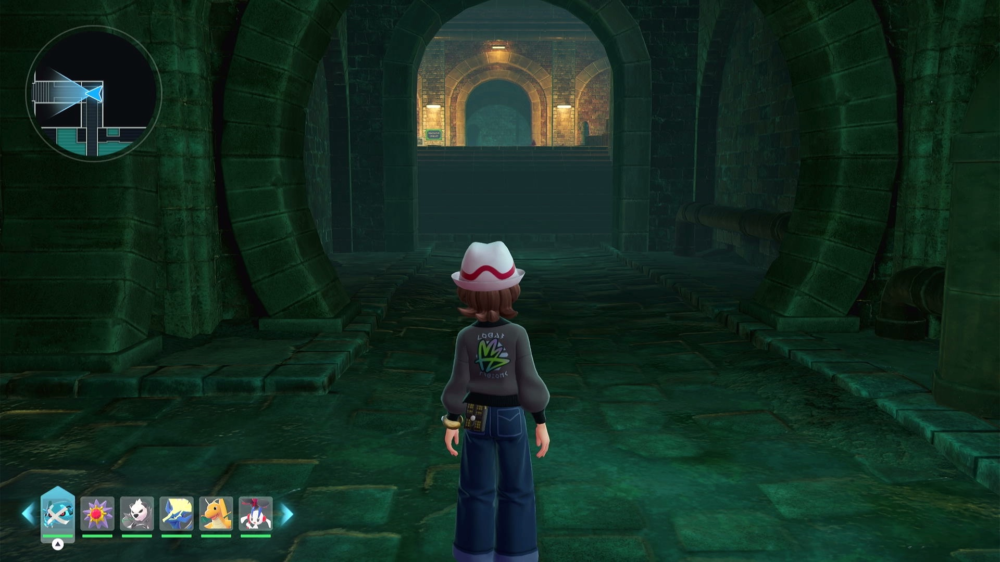
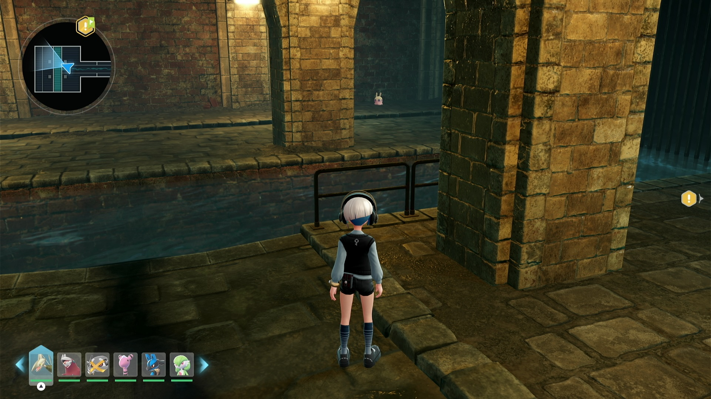
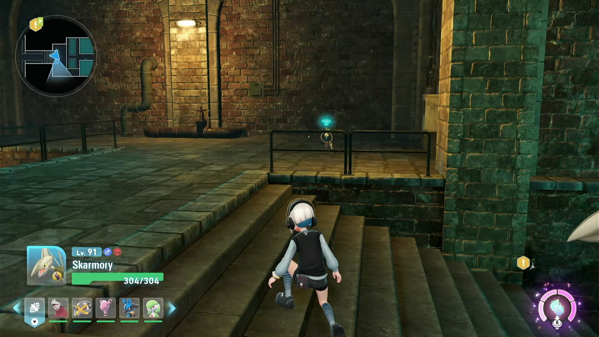

# Shiny Hunt - Sewer Hunter

## Program Description

Shiny hunt by running back and forth repeatedly in two sewer subzones.

### Supported Hunting Route

1. Klefki
2. Klefki + Inkay + Goomy
3. Litwick
4. Litwick + Skrelp + Haunter
5. Skrelp
6. Skrelp + Inkay
7. Ariados

### Setup of Settings

**Switch Settings:**

1. Screen size: Must be 100% within the Switch settings
2. [Switch 2: All HDR options must be disabled.](../NintendoSwitch/Switch2Notes.md#switch-2-hdr-may-be-problematic)

**Program Settings:**

1. Video Resolution: 1080p or higher

### Instructions/Hunt Routes

### Klefki

Stand just at the entrance of the sewers (near Wild Zone 5).

### Klefki + Inkay + Goomy

Stand just at the entrance of the sewers (near Wild Zone 5).

### Sewers: Litwick

Inside the sewers (near Wild Zone 5), stand as shown in below screenshots. KO alpha Patrat or alpha Klefki if any are nearby.

### Litwick + Skrelp

Inside the sewers (near Wild Zone 5), stand as shown in below screenshots. KO Dragalge and alpha Pokémon around the route beforehand.

### Skrelp

Stand at the entrance of the sewers (at the west of the city).
NOTE: you need to move forward a bit to make sure the Skrelp spawns, after which you *start* the program.

### Skrelp + Inkay

Stand at the entrance of the sewers (at the west of the city). This route is similar as the one above with additional running forward to reach the Inkay.

### Ariados

Inside the sewers (at the west of the city), stand as shown in the screenshots below. KO alpla Skrelp or alpha Inkay if any are near the beginning of the route.

## Options

### Shiny Sound Detected Action

When a shiny sound is heard, perform one of the following actions:

- Stop program and go Home. Send notification.
- Keep running. Notify on first shiny sound only. (default)

### Duration

Run the program for this long and then go to Home screen.

## Shiny Exhibit

## Credits

- **Author:** Saͥbͣeͫr👑Ⰰ/naussika

**Discord Server:**

