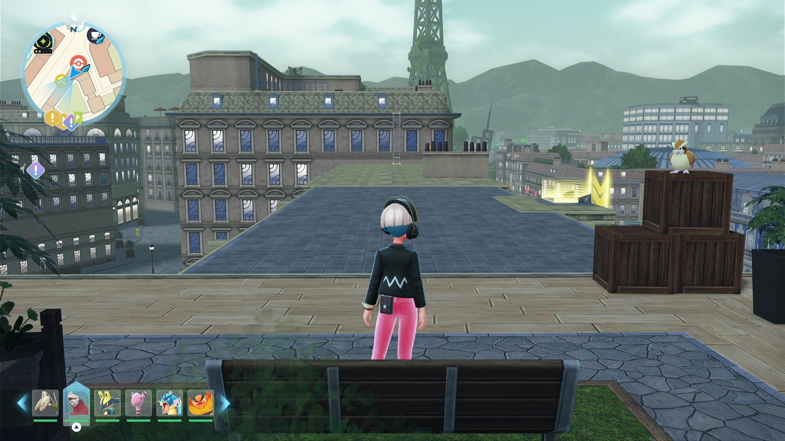
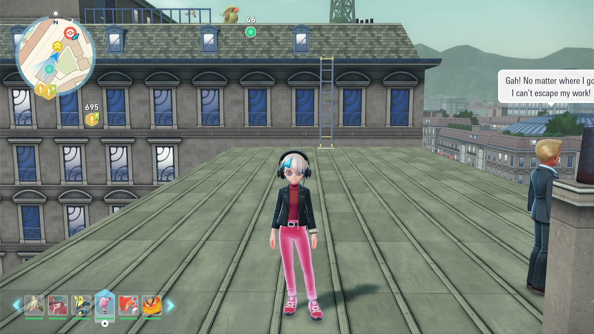

# Shiny Hunt - Shuttle Run (beta testing, not available yet)

## Program Description

Shiny hunt by running back and forth in Lumiose City.

## Supported Hunting Route

1. Alpha Pidgeot

More routes and even customised routes are in planning.

### Setup of Settings

**Switch Settings:**

1. Screen size: Must be 100% within the Switch settings
2. [Switch 2: All HDR options must be disabled.](../NintendoSwitch/Switch2Notes.md#switch-2-hdr-may-be-problematic)

**Program Settings:**

1. Video Resolution: 1080p or higher

### Instructions/Hunt Routes

### Alpha Pidgeot

Fast travel to Hibernal Pokemon Center, take the elevator nearby and get to the roof. Walk to the bench on the left side and stand right before the bench, facing where the building alpha Pidgeot would spawn. You may need to adjust a bit for the direction angel to make sure you won't either fall off or get blocked while running back and forth. You can also do a bench sit here, which will automatically calibrate and correct the position.

## Options

### Shiny Sound Detected Action

When a shiny sound is heard, perform one of the following actions:

- Stop program and go Home. Send notification.
- Keep running. Notify on first shiny sound only. (default)

### Duration

Run the program for this long and then go to Home screen.

## Credits

- **Author:** Saͥbͣeͫr👑Ⰰ/naussika

**Discord Server:**

