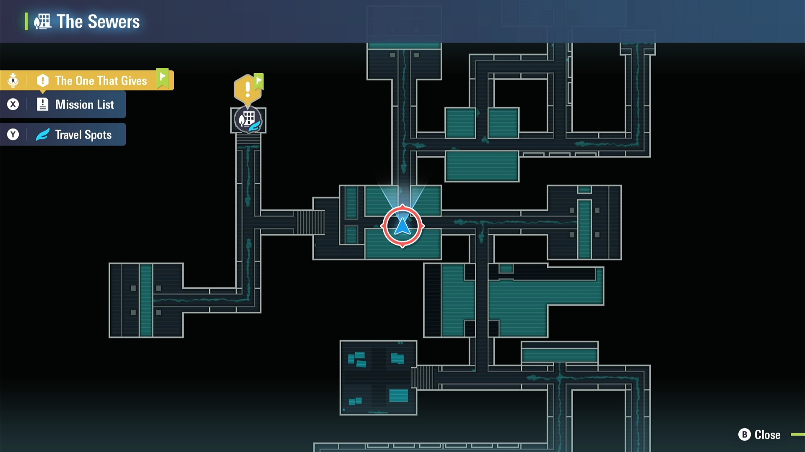
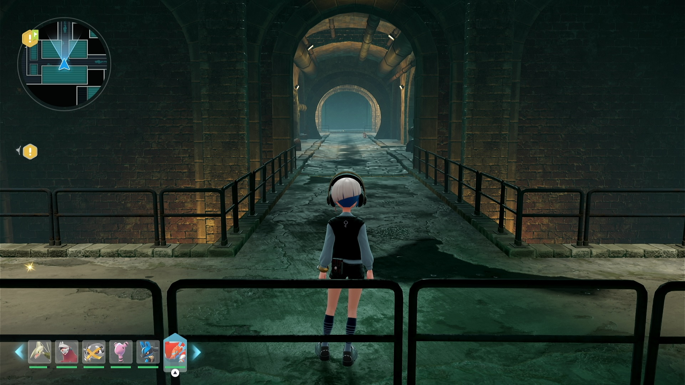
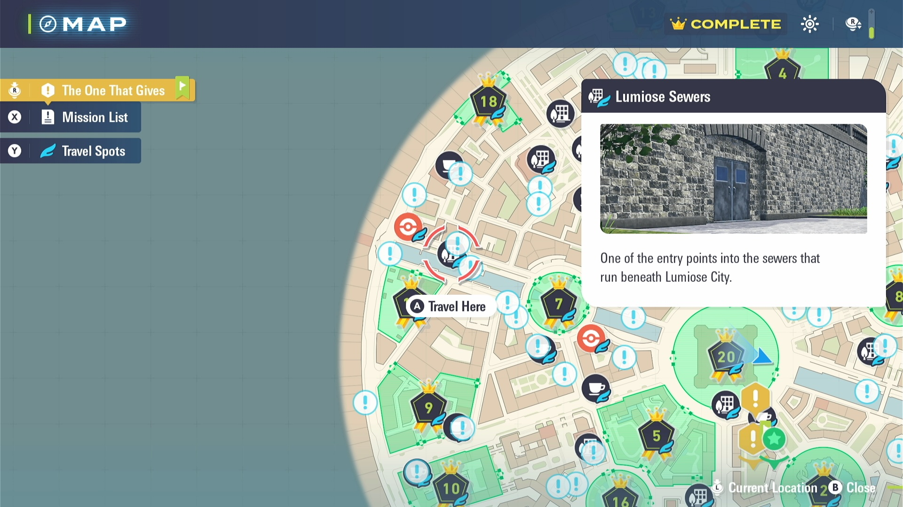
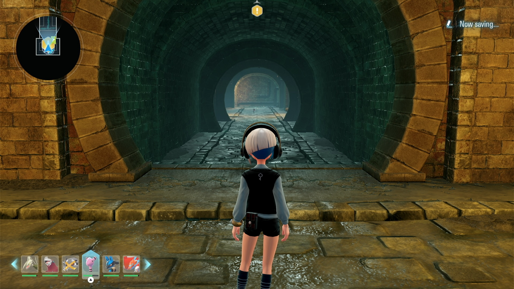
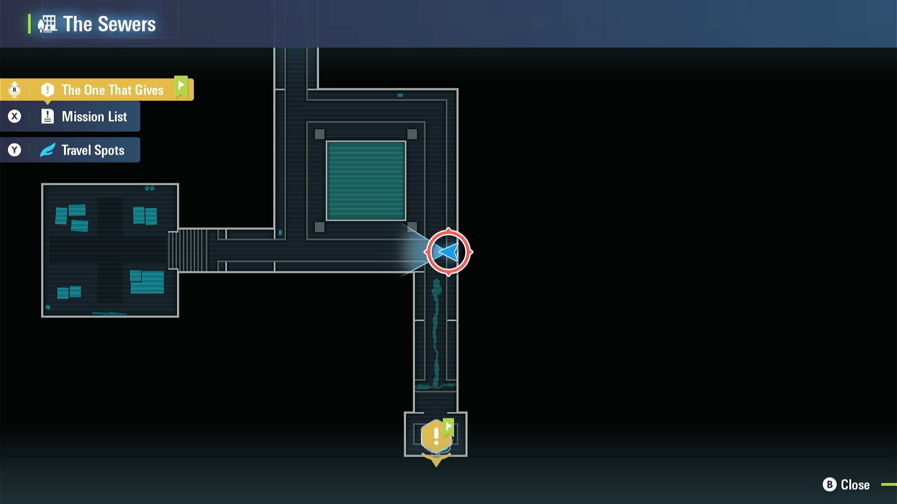
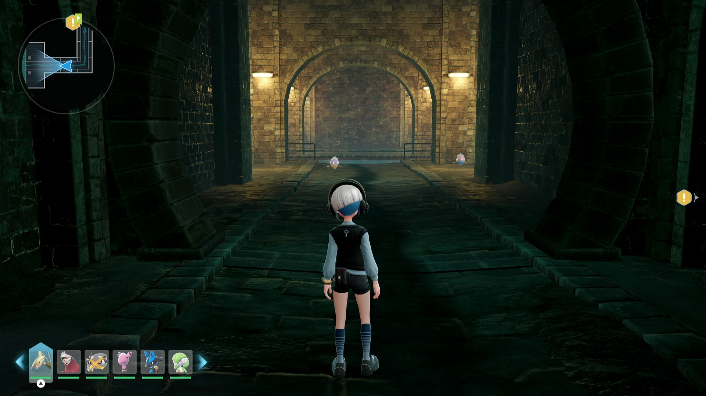

# Shiny Hunt - Shuttle Run (beta testing, not available yet)

## Program Description

Shiny hunt by repeatedly running back and forth or running with fast travel.

Currently the program mainly hunts pokemon in the Lumiose Sewers. We may extend it for hunting in the Lumiose City as well.

## Supported Hunting Route

1. Sewers: Klefki
2. Sewers: Klefki + Inkay + Goomy
3. Sewers: Litwick
4. Sewers: Skrelp
5. Sewers: Skrelp + Inkay
6. Sewers: Skrelp + Ariados

More routes and even customised route are in planning.

## Instructions/Hunt Route

### Setup of Settings

**Switch Settings:**

1. Screen size: Must be 100% within the Switch settings
2. [Switch 2: All HDR options must be disabled.](../NintendoSwitch/Switch2Notes.md#switch-2-hdr-may-be-problematic)

**Program Settings:**

1. Video Resolution: 1080p or higher

### Sewers: Klefki

Stand just at the entrance of the sewers (near Wild Zone 5).

### Sewers: Klefki + Inkay + Goomy

Stand just at the entrance of the sewers (near Wild Zone 5).

### Sewers: Litwick

Inside the sewers (near Wild Zone 5), stand as shown in below screenshots. KO alpha Patrat or alpha Klefki if any are nearby.

### Sewers: Skrelp

Stand at the entrance of the sewers (at the west of the city).
NOTE: you need to move forward a bit to make sure the Skrelp spawns, after which you *start* the program.

### Sewers: Skrelp + Inkay

Stand at the entrance of the sewers (at the west of the city). This route does similar as the above one, with running forward to reach the Inkay.

### Sewers: Skrelp + Ariados

Inside the sewers (at the west of the city), stand as shown in below screenshots. KO alpla Skrelp or alpha Inkay if any are nearby the beginning of the route.

## Options

### Shiny Sound Detected Action

When a shiny sound is heard, perform one of the following actions:

- Stop program and go Home. Send notification.
- Keep running. Notify on first shiny sound only. (default)

### Duration

Run the program for this long and then go to Home screen.

## Shiny Exhibit

## Credits

- **Author:** Saͥbͣeͫr👑Ⰰ/naussika

**Discord Server:** 

