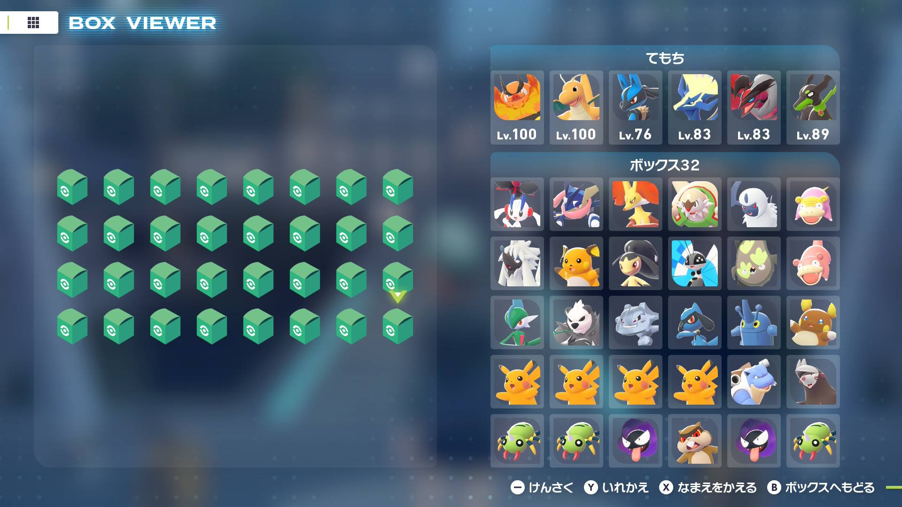
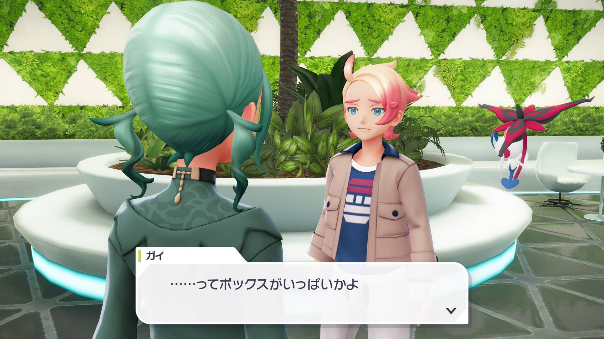
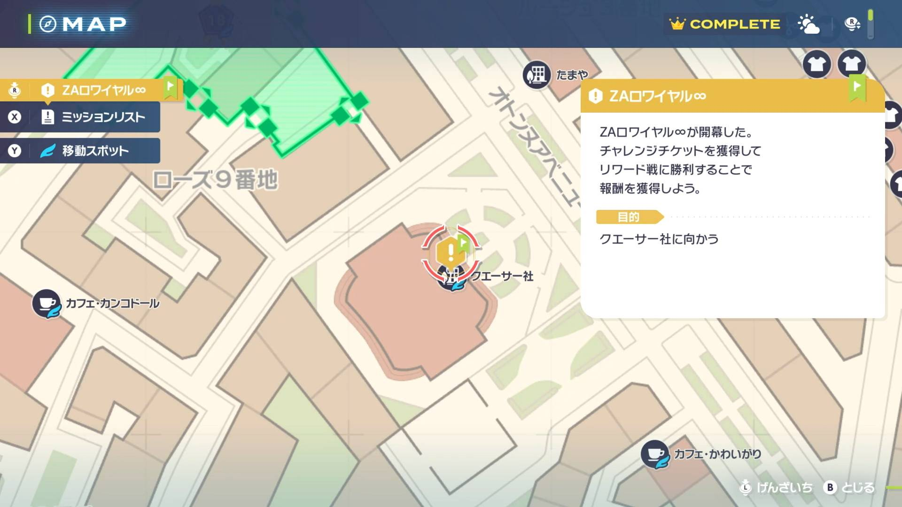

# Stats Reset

## Program Description

Reset gift Pokémon for desired stats.

**Currently Supported Pokémon:**

1. AZ's Floette

**DISCLAIMER:** This program utilizes the backup saves to reset for Pokémon stats and often requires long setup, make sure you fully understand what you need to do before starting the program.

### Setup of Settings

**Switch Settings:**

1. Screen size: Must be 100% within the Switch settings
2. [Switch 2: All HDR options must be disabled.](../NintendoSwitch/Switch2Notes.md#switch-2-hdr-may-be-problematic)
3. [Switch 2: The profile you are using must be the 1st (left-most) profile.](../NintendoSwitch/Switch2Notes.md#resetting-a-game-moves-the-cursor-to-the-1st-user-profile)

**Program Settings:**

1. Video Resolution: 1080p or higher
2. The language in the option must match your in-game language.

**Game Settings:**

1. Text Speed: Fast

**Preparation for AZ's Floette:**

1. Have full boxes and party slots, you can verify this if you can no longer throw balls at wild Pokémon. 
2. Proceed with the 15th reward battle against the rival, enter Quasartico Inc. for the first half of the dialog until your rival tries to give you AZ's Floette but can't due to the full box slots. 
3. Set the guide pin to Quasartico Inc. so that opening the map from the main menu (X press then Plus press) placecs the cursor right above the Quasartico Inc. fly spot. 
4. Make room on the top left slot in the box system, make sure that this is where the cursor is when opening the box system from the main menu.
5. Fly to any Pokémon Center and place a new backup save by healing.
6. Start the program in game.

### Program Settings

### Go Home when Done:

After finding a match, go to the Switch Home to idle. This is helpful in preventing day/night switch in game after a match.

### Game Language:

Set this to the language of your game. This is **REQUIRED** for text recognition.

### Gift Pokémon:

The Pokémon you are resetting for.

### Stats:

The desired IV spread for each stat.

## Credits

- **Author:** Nymphea

**Discord Server:** 

