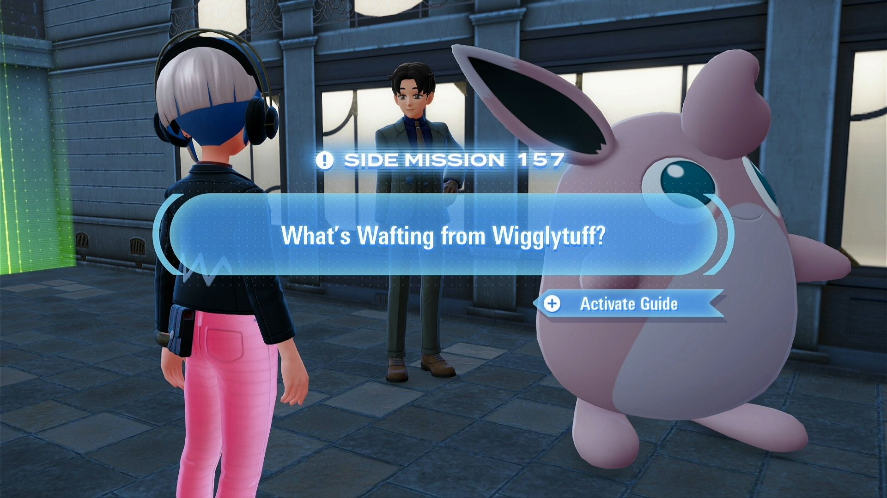
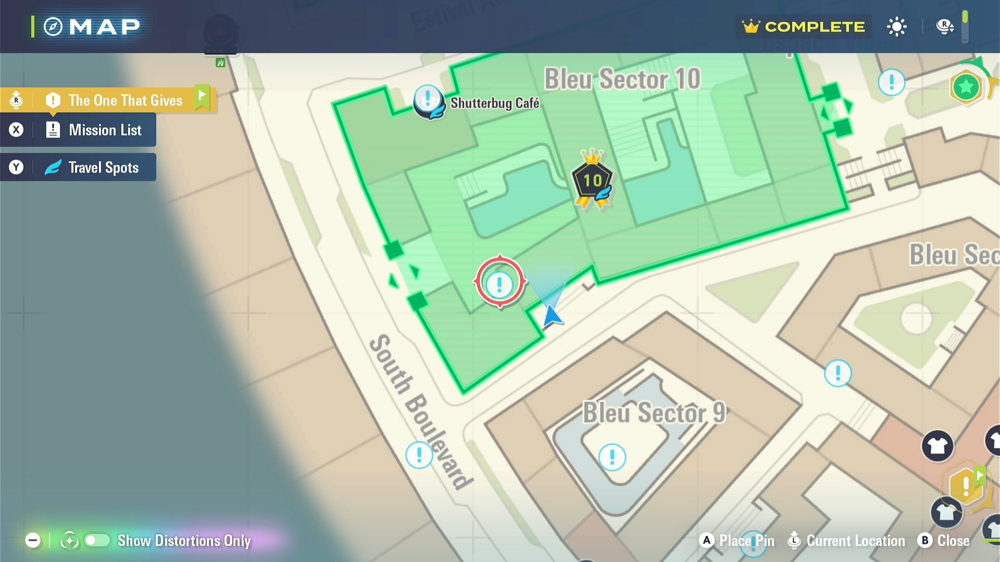
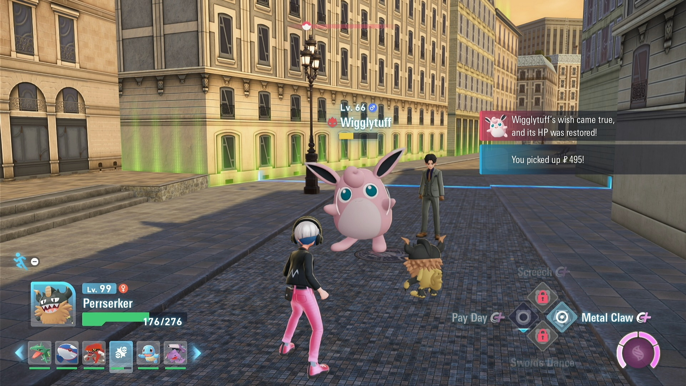
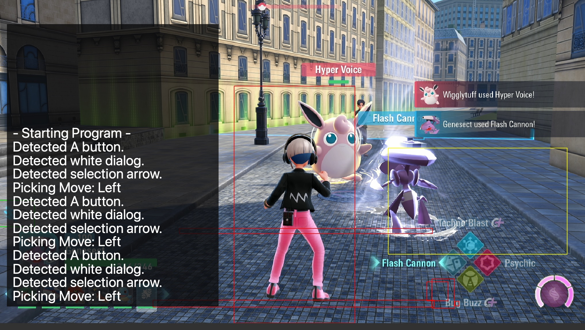
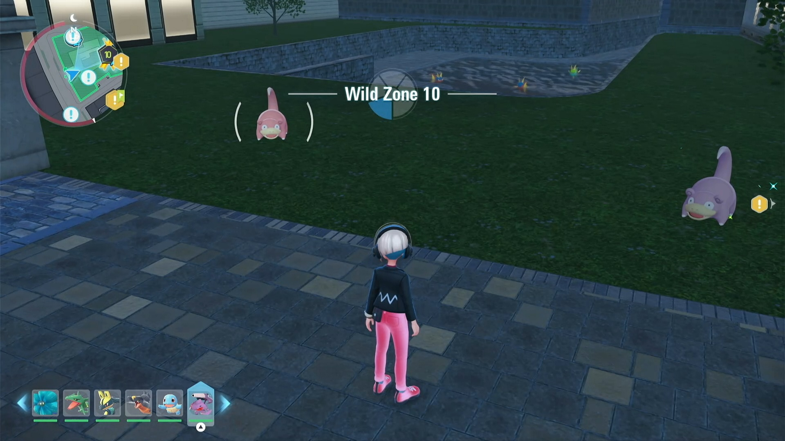
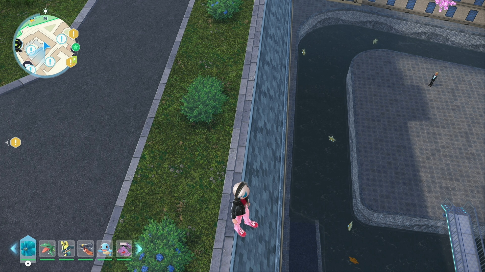

# Wigglytuff Farmer

## Program Description

Repeatedly battle Bain the Rich Boy's Wigglytuff to farm experience, and money.

NOTE:

- you'll need DLC to unlock this quest (Side Mission 157)
- do **NOT** complete this quest

### Setup of Settings

**Switch Settings:**

1. Screen size: Must be 100% within the Switch settings
2. [Switch 2: All HDR options must be disabled.](../NintendoSwitch/Switch2Notes.md#switch-2-hdr-may-be-problematic)

**Program Settings:**

1. Video Resolution: 1080p or higher

**Game Settings:**

1. Text Speed: Fast

### Instructions

1. Make sure you have one Pokemon that knows *Bubble Beam* move in your party otherwise you'll not be able to start the battle.
2. Use left Dpad to select the Pokemon you'd like to battle the Wigglytuff. Don't use the Pokemon with *Bubble Beam* move.
3. Stand facing Bain the Rich Boy, and make sure A button is visible.
4. Start the program in the game.

*optional*: have all 3 Gold Canari Plushies to maximise money gain.

### Tips

The battle AI is same as in [Restraurant Farmer](RestaurantFarmer.md).

You'll receive 4752 poke dollar (with 3 Gold Canari Plush) each time you beat the Wigglytuff. In one hour, you can battle ~89 rounds, that's roughly **420k per hour**.

While *Pay Day* can grant you extra money, it will not be faster in money farming since it cannot OHKO the Wigglytuff.

### Recommended Pokémon

To beat the Wigglytuff efficiently, you'd better use a level 100 Pokemon, properly EV trained/hypertrained. And since the Wigglytuff may dodge the first move, a second OHKO move is also necessary.

Recommended setups that can OHKO it:

- Genesect with *Flash Cannon*, *Techno Blast*;
- Metagross with *Heavy Slam*, *Iron Head*;
- Gholdengo with *Make It Rain*, *Flash Cannon*.

## Bonus Shiny Hunting

This side mission is just located next to Wild Zone 10, so repeatedly battle here would also reset spawns nearby. Beware that if you have shiny stashed elsewhere they may get eliminated after you roll some shiny in Wild Zone 10 or nearby buildings after hours of battling. 

## Credits

- **Author:** Saͥbͣeͫr👑Ⰰ/naussika

Code for Wigglytuff Farmer heavily relies on [Restraurant Farmer](RestaurantFarmer.md).

**Discord Server:** 

