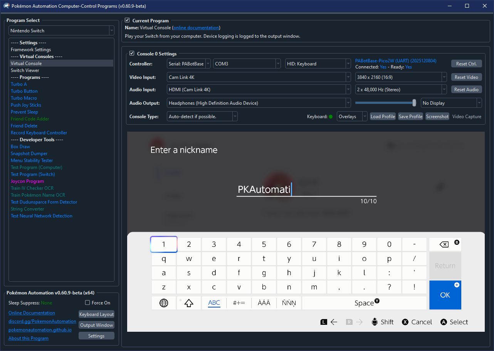
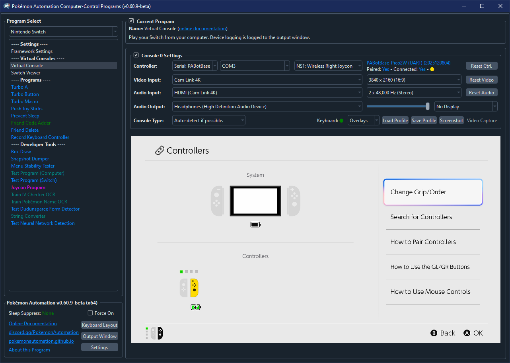
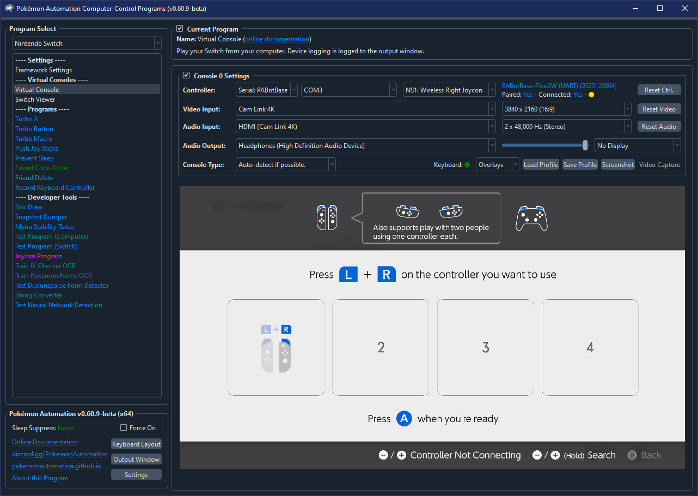
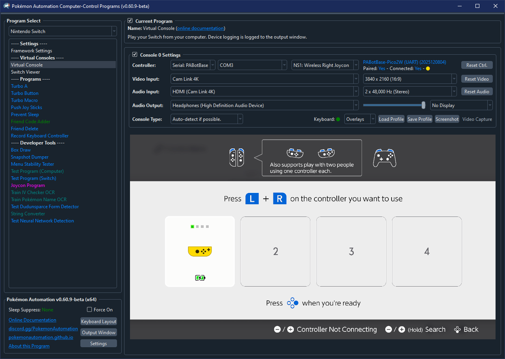
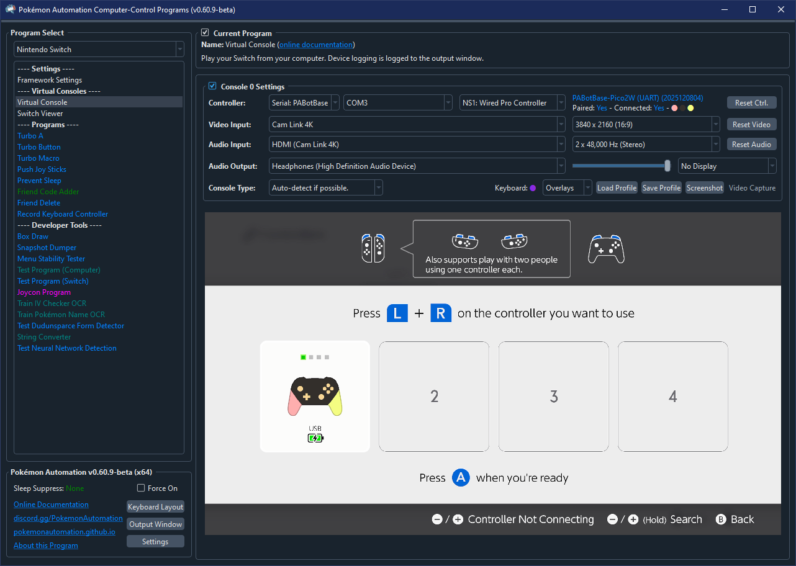
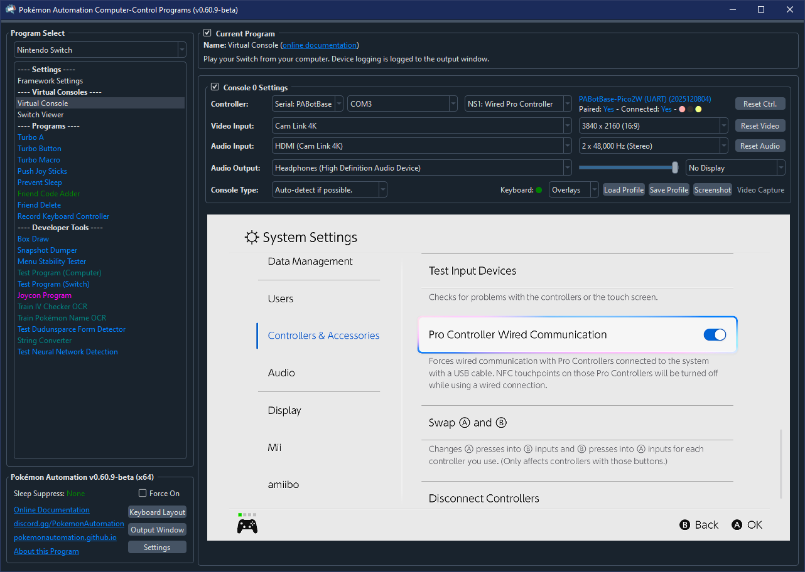

# Controller Guide

This is a guide for all the differnet controller types that we support.

## HID: Keyboard

### Supported Devices/Boards:

- ESP32-S3
- Pico W (UART mode)
- Pico 2 W (UART mode)

The HID keyboard is just a standard USB keyboard. Since it is not a controller, it cannot be used to play the Nintendo Switch. But it can be used to enter text fields include code entries.

### How to Connect:

Since the HID keyboard is not a game controller, it does connect through the grip menu. Instead, it connects automatically whenever it's physically connected to the Switch.

Just bring up any Switch menu that has a keyboard or a numberpad, and the HID keyboard will work. Programs that do code entry (such as Fast Code Entry) will enter the code right away. If your window has keyboard controls active, just begin typing into your keyboard and it will show up on the Switch's text field.

### Keyboard Layouts:

The default keyboard layout is the US QWERTY layout. If either your computer or your Switch is not QWERTY, what you type into your keyboard will not be what shows up on the Switch.

If your computer's keyboard layout does is not QWERTY, you will need to change the option in the settings:

- Settings (bottom left corner of the program) -> "System Keyboard Layout"

As of this writing, we only support QWERTY and the French AZERTY. We are open to contributions of other keyboard layouts.

## NS1: Wired Controller

 

### Supported Devices/Boards:

- ESP32-S3
- Pico W (UART mode)
- Pico 2 W (UART mode)

This is the standard 3rd party wired controller from the likes of Horipad and Power A. It supports 14 buttons and 2 joysticks. It does not support rumble or gyro. Furthermore, it always shows up as a black controller in the Switch menus.

### How to Connect:

As a wired controller, you do not need to be in the grip menu to connect. Just press any button and it will connect.

Note that if you are in a 1-player game and you already have a controller connected as the 1st controller slot, you will not be able to connect any other controller until you either disconnect that controller or return to the Switch menus.

## NS2: Wired Controller

 

### Supported Devices/Boards:

- ESP32-S3
- Pico W (UART mode)
- Pico 2 W (UART mode)
- Arduino Uno R3
- Arduino Leonardo
- Pro Micro
- Teensy 2.0
- Teensy++ 2.0

This is the standard 3rd party wired controller for the Switch 2 from the likes of Horipad and Power A. It supports 17 buttons and 2 joysticks and it backwards compatible with the Switch 1. It does not support rumble or gyro. Furthermore, it always shows up as a black controller in the Switch menus.

As this is a Switch 2 controller, it supports the GL, GR, and C buttons on the Switch 2. These buttons do nothing on the Switch 1. As of this writing, this is the only controller that we support which has the GL, GR, and C buttons.

### How to Connect:

As a wired controller, you do not need to be in the grip menu to connect. Just press any button and it will connect.

Note that if you are in a 1-player game and you already have a controller connected as the 1st controller slot, you will not be able to connect any other controller until you either disconnect that controller or return to the Switch menus.

## NS1: Wireless Pro Controller

 

### Supported Devices/Boards:

- ESP32
- Pico W (all modes)
- Pico 2 W (all modes)

This is the official OEM Pro Controller for the Nintendo Switch. It supports 14 buttons, 2 joysticks, rumble, gyro, NFC, and wake up (though this project does not support gyro, NFC or wake up).

This controller supports custom colors. As a wireless controller, this is useful for determining which device is connected to which Switch when there are multiple setups in the same vicinity.

### How to Connect:

As a wireless controller, it first needs to be paired with the Switch via the grip menu.

1. Navigate to the grip menu by other means.
2. In the controller dropdown, change the controller to `NS1: Wireless Pro Controller`.
3. Wait a few seconds for it to connect. If successful, it will appear as the image above (with randomized colors).

### Pairing Behavior:

(This section is the same for all the Switch 1 wireless controllers.)

Once you connect the controller to the Switch, it will remember its pairing state with that Switch. Each wireless controller (Pro Controller, Left/Right Joycon, etc...) has a separate pairing state. So pairing one will not automatically pair the others.

Keep in mind the following behaviors:

- When you switch from a different controller to a wireless controller that was previous paired, it will reconnect to the same console it is paired with.
- When you click "Reset Ctrl", it will disconnect and try to reconnect to the console that it was paired with.
- When you SHIFT + click "Reset Ctrl", not only does it reset, it will clear the pairing state and try to pair with a new console.
- The device (ESP32/Pico) will forget its pairing state when it loses power. So unlike a real controller, it is not stored in non-volatile memory.

Once the controller is paired with a console, it will be able to reconnect outside of the grip menu.

### Troubleshooting:

- If the device to fails connect after multiple attempts, try rebooting the Switch.
- If you see `Paired: Yes - Connected: No`, it probably means the device is paired with a different Switch. SHIFT + click "Reset Ctrl" to clear the pairing state and re-pair in the grip menu. If you previously paired using the wired version of this controller, you may be hitting [Issue 887](https://github.com/PokemonAutomation/Arduino-Source/issues/887).
- If you see `Disconnected by console.` when trying to reconnect, you are hitting [Issue 800](https://github.com/PokemonAutomation/Arduino-Source/issues/800). SHIFT + click "Reset Ctrl" to clear the pairing state and re-pair in the grip menu.

## NS1: Wireless Left/Right Joycon

 

### Supported Devices/Boards:

- ESP32
- Pico W (all modes)
- Pico 2 W (all modes)

These are the official OEM Joycons for the Nintendo Switch. They support 11 buttons, 1 joystick, rumble, gyro, NFC, and wake up (though this project does not support gyro, NFC or wake up).

These joycon controllers support custom colors. As wireless controllers, this is useful for determining which device is connected to which Switch when there are multiple setups in the same vicinity.

As of this writing, the right joycon is primarily used for Pokémon Let's Go Pikachu and Eevee (LGPE). While both joycons can be used to play LGPE, we choose the right joycon since it has the Home button for soft resets. No programs use the left joycon.

### How to Connect:

As a wireless controller, it first needs to be paired with the Switch via the grip menu.

1. Navigate to the grip menu by other means.
2. In the controller dropdown, change the controller to `NS1: Wireless Left Joycon` or `NS1: Right Joycon`.
3. Wait a few seconds for it to connect. If successful, it will appear as grey rotating joycon image below.

When the joycon appears as a light grey rotating image, the Switch wants you to pair it with a second joycon before it will show up. For our purposes we do not pair joycons together since you can just use the Pro Controller instead.

There are two ways to exit the gripo menu as a joycon without pairing it with a 2nd joycon:

**Enter Horizontal Mode:**

One way to exit the grip menu with a single joycon is to enter horizontal mode. Press SR and SL simultaneously to enter horizontal mode. Using the default keyboard mappings, this is F1 and F3.

**Exit to Home (Right Joycon Only):**

If you are using the right joycon, you can exit directly to the Home menu by simply pressing the Home button. This will enter the Home menu with only one joycon (half a controller). So you won't be able to do anything that requires the left half.

Nevertheless, this is the preferred way to setup and enter LGPE for automation.

### Pairing Behavior:

(This section is the same for all the Switch 1 wireless controllers.)

Once you connect the controller to the Switch, it will remember its pairing state with that Switch. Each wireless controller (Pro Controller, Left/Right Joycon, etc...) has a separate pairing state. So pairing one will not automatically pair the others.

Keep in mind the following behaviors:

- When you switch from a different controller to a wireless controller that was previous paired, it will reconnect to the same console it is paired with.
- When you click "Reset Ctrl", it will disconnect and try to reconnect to the console that it was paired with.
- When you SHIFT + click "Reset Ctrl", not only does it reset, it will clear the pairing state and try to pair with a new console.
- The device (ESP32/Pico) will forget its pairing state when it loses power. So unlike a real controller, it is not stored in non-volatile memory.

Once the controller is paired with a console, it will be able to reconnect outside of the grip menu.

### Troubleshooting:

- If the device to fails connect after multiple attempts, try rebooting the Switch.
- If you see `Paired: Yes - Connected: No`, it probably means the device is paired with a different Switch. SHIFT + click "Reset Ctrl" to clear the pairing state and re-pair in the grip menu. If you are using the Pico W (UART) mode and previously paired using the wired version of this controller, you may be hitting [Issue 887](https://github.com/PokemonAutomation/Arduino-Source/issues/887).
- If you see `Disconnected by console.` when trying to reconnect, you are hitting [Issue 800](https://github.com/PokemonAutomation/Arduino-Source/issues/800). SHIFT + click "Reset Ctrl" to clear the pairing state and re-pair in the grip menu.

## NS1: Wired Pro Controller

 

### Supported Devices/Boards:

- ESP32-S3
- Pico W (UART mode)
- Pico 2 W (UART mode)

This is the same as the wireless Pro Controller, but rather than wireless, it is connected to the Switch over USB. It supports mostly the same features. (14 buttons, 2 joysticks, rumble, gyro, etc...)

This controller supports custom colors. As a wireless controller, this is useful for determining which device is connected to which Switch when there are multiple setups in the same vicinity.

### How to Connect:

Unlike the 3rd party wired controllers, there is one additional step to use this controller. You must enable the following option:

This extra step is needed because the Pro Controller is naturally a wireless controller. So it intends users to use wirelessly instead of over USB.

After you have enabled this option, it will connect the same way as any other wired controller. Just press any button and it will connect. You do not need to be in the grip menu. You don't not need pair it.

Note that if you are in a 1-player game and you already have a controller connected as the 1st controller slot, you will not be able to connect any other controller until you either disconnect that controller or return to the Switch menus.

**Discord Server:** 

